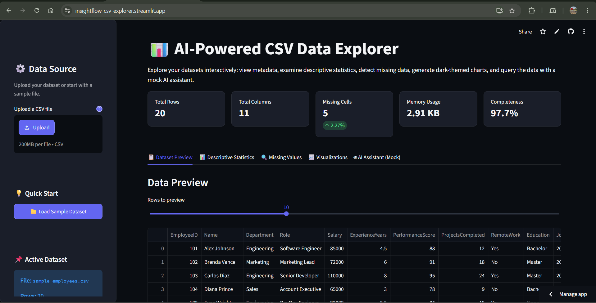

# AI-Powered CSV Data Explorer

An interactive Streamlit dashboard for exploring CSV datasets through automated profiling, descriptive statistics, missing-value analysis, interactive visualizations, and a local natural-language data assistant.

[Live Demo](https://insightflow-csv-explorer.streamlit.app/) | [GitHub Repository](https://github.com/rudrasharma26/insightflow)

## Dashboard Preview

## Features

- Upload and explore CSV datasets
- Dataset overview with total rows, columns, missing cells, memory usage, and completeness
- Dataset preview
- Descriptive statistics for numerical and categorical columns
- Missing-value analysis
- Interactive Plotly visualizations
  - Histograms
  - Box plots
  - Violin plots
  - Correlation heatmaps
  - Scatter plots
  - OLS trendlines
  - Categorical bar charts
  - Donut charts
- Local natural-language AI Assistant
- Modern dark-themed dashboard
- Built-in sample employee dataset
- Automated test suite with 21 passing tests

## AI Assistant

The application includes a local heuristic NLP engine that interprets common natural-language questions about the loaded dataset.

Example questions:

    How many rows are there?
    What is the average salary?
    What is the maximum salary?
    Which columns have missing values?
    What is the correlation between salary and experience?
    Show the distribution of departments.

The AI Assistant runs locally and does not require an external API key or third-party AI service.

## Tech Stack

| Technology | Purpose |
|---|---|
| Python | Core programming language |
| Streamlit | Interactive web application |
| Pandas | Data loading and analysis |
| NumPy | Numerical operations |
| Plotly | Interactive visualizations |
| Pytest | Automated testing |

## Project Architecture

The application uses a modular structure separating the Streamlit interface from data processing, visualization, and AI-query logic.

    insightflow/
    ├── .streamlit/
    │   └── config.toml
    ├── data/
    │   └── sample_employees.csv
    ├── src/
    │   ├── __init__.py
    │   ├── data_processor.py
    │   ├── mock_ai_engine.py
    │   └── visualizations.py
    ├── tests/
    │   ├── __init__.py
    │   ├── test_data_processor.py
    │   ├── test_mock_ai_engine.py
    │   └── test_visualizations.py
    ├── app.py
    ├── requirements.txt
    ├── .gitignore
    └── README.md

### Core Modules

- `app.py` — Main Streamlit application and user interface.
- `src/data_processor.py` — CSV loading, dataset summaries, statistics, and missing-value analysis.
- `src/visualizations.py` — Reusable Plotly visualization functions.
- `src/mock_ai_engine.py` — Local heuristic natural-language query engine.
- `tests/` — Automated tests for data processing, AI queries, visualizations, and edge cases.

## Testing

The project includes automated tests covering:

- CSV loading
- Dataset summaries
- Numerical statistics
- Categorical statistics
- Missing-value analysis
- Natural-language AI queries
- Visualization generation
- Small and edge-case datasets

Current test status:

    21 passed

Run the test suite locally:

    python -m pytest -q

## Run Locally

### 1. Clone the repository

    git clone https://github.com/rudrasharma26/insightflow.git
    cd insightflow

### 2. Create a virtual environment

    python -m venv .venv

### 3. Activate the environment

Windows PowerShell:

    .venv\Scripts\Activate.ps1

### 4. Install dependencies

    pip install -r requirements.txt

### 5. Run the application

    python -m streamlit run app.py

The application will be available at:

    http://localhost:8501

## Deployment

The application is deployed using Streamlit Community Cloud and is connected directly to the GitHub repository.

[Open the Live Application](https://insightflow-csv-explorer.streamlit.app/)

## Future Improvements

- Integration with production LLM APIs
- More advanced automated dataset profiling
- Additional visualization types
- Exportable analysis reports
- Support for larger datasets
- User-configurable dashboard themes
- More advanced natural-language data analysis

## Author

Rudra Sharma

A portfolio project focused on Python, data analytics, data visualization, and AI-assisted data exploration.
